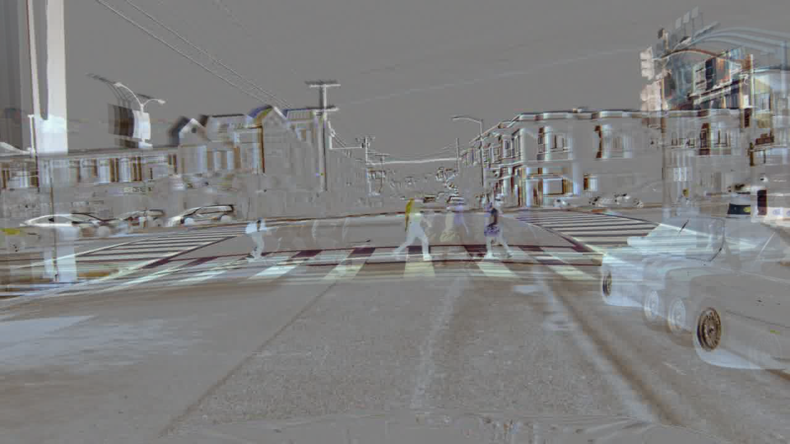

# Dynamic Image Python Generator

Python script that approximates dynamic images. Dynamic image encodes motion in a image sequence. It is not as descriptive as optical flow but faster to compute. Dynamic images achieve [competitve results for action recognition](www.egavves.com/data/cvpr2016bilen.pdf).

This implementation is similar to the MATLAB version in this [link](https://github.com/hbilen/dynamic-image-nets) 

Sample Results

| Input   |      Output      |
|----------|:-------------:|
|  |     |
|  |     |
|----------|:-------------:|

